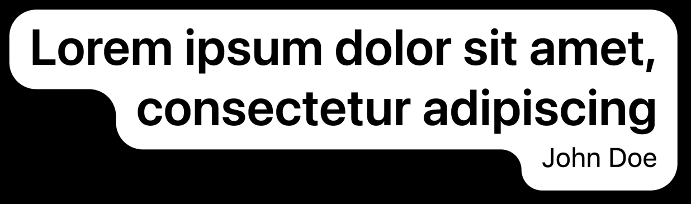

## About The Project



React rounded border is a simple package that can add a round border to elements and text in React.

## Getting Started

This is an example of how you may give instructions on setting up your project locally.
To get a local copy up and running follow these simple example steps.

### Installation

```bash
npm install react-rounded-border
```

## Usage

To add a round border around elements, you first need to add a base. You do so by wrapping your components in a
`<RoundedBorder>` component. After that, any component wrapped inside an `<IncludeBorder>` will be included in the round
border.

For multiline text, if you want each line to be added individually, use `<RoundedTextBorder>` the same way as
`<IncludeBorder>`.

### Props

padding?: number;
minBorderRadius?: number;
borderRadius?: number;
paddingTop?: number;
paddingLeft?: number;
paddingBottom?: number;
paddingRight?: number;
fill?: string;
stroke?: string;
backgroundProps?: HTMLProps<SVGSVGElement>;

#### `<RoundedBorder>`

| Name            | Type                       | Description                                                                                                                                         |
|-----------------|----------------------------|-----------------------------------------------------------------------------------------------------------------------------------------------------|
| padding         | number                     | The padding (in pixels) that should be added to each included rectangle when making the union (think of it as normal up, down, left, right padding) |
| paddingTop      | number                     | Top padding                                                                                                                                         |
| paddingLeft     | number                     | Left padding                                                                                                                                        |
| paddingBottom   | number                     | Bottom padding                                                                                                                                      |
| paddingRight    | number                     | Right padding                                                                                                                                       |
| fill            | string                     | The background color of the rounded border shape                                                                                                    |
| stroke          | string                     | The border color of the rounded border shape                                                                                                        |
| backgroundProps | `HTMLProps<SVGSVGElement>` | React props received by the SVG background element                                                                                                  |

#### `<IncludeBorder>`

| Name    | Type    | Description                                             |
|---------|---------|---------------------------------------------------------|
| enabled | boolean | Enables or disables the `<IncludeBorder>` (Coming soon) |

#### `<RoundedTextBorder>`

| Name    | Type    | Description                                                 |
|---------|---------|-------------------------------------------------------------|
| enabled | boolean | Enables or disables the `<RoundedTextBorder>` (Coming soon) |

## Example

```tsx
import {RoundedBorder, RoundedTextBorder, IncludeBorder} from 'react-rounded-border';

export default function () {
    return (
        <main className='w-screen h-screen bg-black dark flex flex-col'>
            <RoundedBorder
                className='flex flex-col items-end p-20'
                paddingTop={4}
                paddingBottom={8}
                paddingLeft={12}
                paddingRight={12}
                borderRadius={16}
            >
                <RoundedTextBorder className='font-semibold text-black text-3xl w-[450px] text-right'>
                    Lorem ipsum dolor sit amet, consectetur adipiscing
                </RoundedTextBorder>
                <IncludeBorder>
                    <label>John Doe</label>
                </IncludeBorder>
            </RoundedBorder>
        </main>
    );
}
```

## License

MIT licence. See `LICENSE` for more information.
